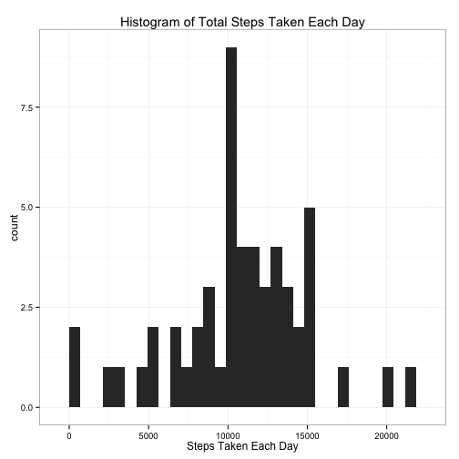
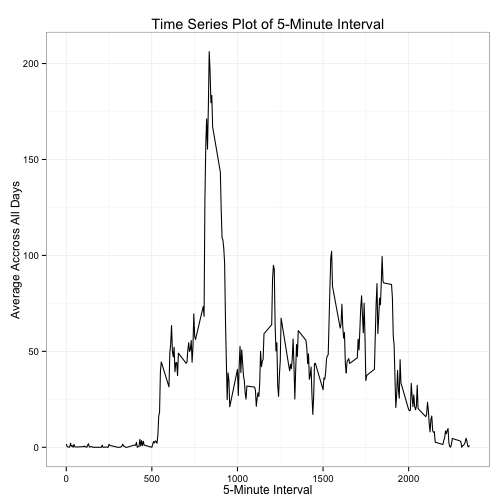
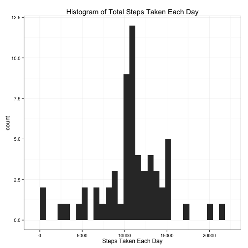
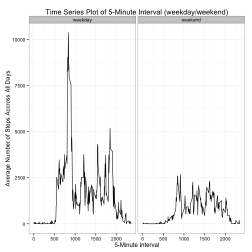

Peer Assignment 1
========================================================
Load the data


```r
df = read.csv("activity.csv", header = T)
```


Aggregate data based on the date


```r
df$date = as.Date(df$date, "%Y-%m-%d")
group_day = with(df, aggregate(df$steps, data.frame(df$date), sum))
```


Make a histogram of the total number of steps taken each day 


```r
library(ggplot2)
ggplot(group_day[!is.na(group_day$x), ], aes(x = x)) + geom_histogram() + theme_bw() + 
    ggtitle("Histogram of Total Steps Taken Each Day") + labs(x = "Steps Taken Each Day")
```

```
## stat_bin: binwidth defaulted to range/30. Use 'binwidth = x' to adjust this.
```

 


Calculate the mean and median total number of steps taken per day


```r
mean(group_day$x, na.rm = T)
```

```
## [1] 10766
```

```r
median(group_day$x, na.rm = T)
```

```
## [1] 10765
```


Aggredate data based on the time interval


```r
group_interval = with(df, aggregate(df$steps, data.frame(df$interval), function(x) mean(x, 
    na.rm = T)))
```


Time series plot of 5-minute interval and the average number of steps taken, averaged accross all days


```r
ggplot(group_interval) + geom_line(aes(x = df.interval, y = x)) + theme_bw() + 
    ggtitle("Time Series Plot of 5-Minute Interval") + labs(x = "5-Minute Interval", 
    y = "Average Accross All Days")
```

 


Find out which 5-minute interval, on average across all the days in the dataset, contains the maximum number of steps

```r
group_interval$df.interval[group_interval$x == max(group_interval$x)]
```

```
## [1] 835
```


Number of missing values in the dataset (i.e. the total number of rows with NAs)


```r
sum(!complete.cases(df))
```

```
## [1] 2304
```


Filling in all of the missing values in the dataset with the mean for that 5-minute interval

```r
names(group_interval) = c("interval", "steps_mean")
library(plyr)
temp = join(df[is.na(df$steps), ], group_interval, by = "interval", type = "left")
```


Create a new dataset that is equal to the original dataset but with the missing data filled in.

```r
newdf = df
newdf$steps[is.na(newdf$steps)] = temp$steps_mean
```


Histogram of the total number of steps taken each day

```r
group_day_2 = with(newdf, aggregate(newdf$steps, data.frame(newdf$date), sum))
ggplot(group_day_2, aes(x = x)) + geom_histogram() + theme_bw() + ggtitle("Histogram of Total Steps Taken Each Day") + 
    labs(x = "Steps Taken Each Day")
```

```
## stat_bin: binwidth defaulted to range/30. Use 'binwidth = x' to adjust this.
```

 


Calculate the mean and median total number of steps taken per day

```r
mean(group_day_2$x)
```

```
## [1] 10766
```

```r
median(group_day_2$x)
```

```
## [1] 10766
```


The medain of steps taken each day increases by 1, while the mean remains the same. Inputing missing data with the mean of 5-minute interval sum don't have a big impact of the previous estimate. 

Create a new factor variable in the dataset with two levels – “weekday” and “weekend”

```r
newdf$day = as.factor(weekdays(newdf$date))
levels(newdf$day)[levels(newdf$day) == "Saturday" | levels(newdf$day) == "Sunday"] = "weekend"
levels(newdf$day)[levels(newdf$day) != "weekend"] = "weekday"
```


Make a panel plot containing a time series plot (i.e. type = "l") of the 5-minute interval (x-axis) and the average number of steps taken, averaged across all weekday days or weekend days (y-axis). 

```r
group_weekday = with(newdf, aggregate(newdf$steps, data.frame(newdf$interval, 
    newdf$day), sum))
ggplot(group_weekday) + geom_line(aes(x = newdf.interval, y = x)) + facet_grid(. ~ 
    newdf.day) + theme_bw() + ggtitle("Time Series Plot of 5-Minute Interval (weekday/weekend)") + 
    labs(x = "5-Minute Interval", y = "Average Number of Steps Accross All Days")
```

 


